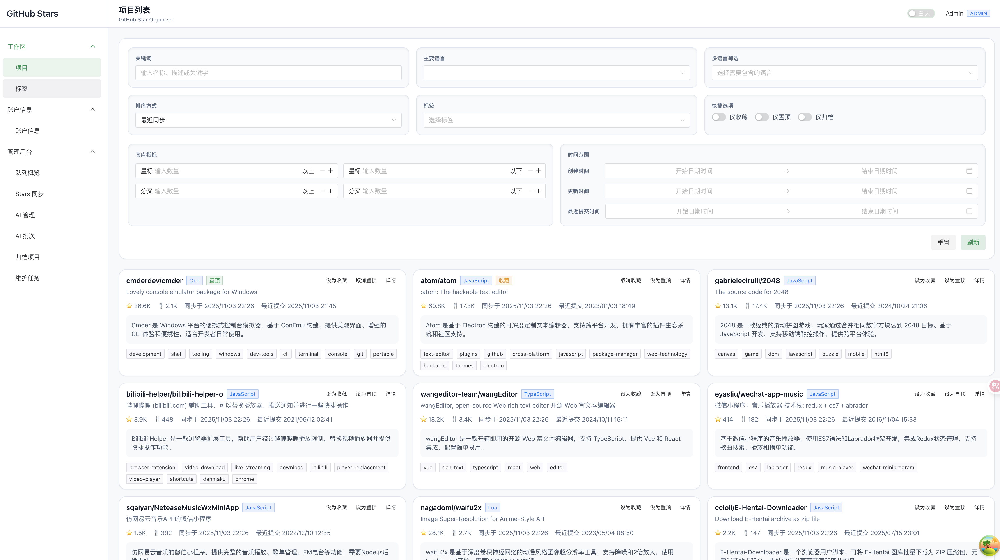

<h1 align="center">
  
  GitHub Star Organizer · Frontend
</h1>
<p align="center">
Vue 3 + Naive UI 的管理面板，为 GitHub Star Organizer 后端提供可视化操作、过滤与队列管控。
</p>
<p align="center">
  
</p>

## 目录
- [目录](#目录)
- [特性概览](#特性概览)
- [技术栈](#技术栈)
- [快速开始](#快速开始)
- [环境变量](#环境变量)
- [目录结构](#目录结构)
- [状态管理与数据流](#状态管理与数据流)
- [UI 体验](#ui-体验)
- [API 与错误处理](#api-与错误处理)
- [测试策略](#测试策略)
- [开发脚本](#开发脚本)
- [与后端协同](#与后端协同)
- [Roadmap / 可扩展点](#roadmap--可扩展点)
- [贡献](#贡献)
- [许可证](#许可证)
- [参考](#参考)

---
## 特性概览
| 模块 | 功能 | 说明 |
|------|------|------|
| 认证与权限 | 登录 / 注册 / 修改密码 / 自动刷新 Token | Pinia 存储访问令牌，失效后透明刷新并回落至登录页 |
| 项目浏览 | 智能过滤、关键字、语言、标签、星标/收藏、多维排序 | Query 参数保持筛选状态，支持区间筛选（Star/Fork/时间）与路由持久化 |
| 项目详情 | README 摘要、标签、同步信息、AI 摘要记录 | 与后端结构化接口对齐，展示最新同步/AI 状态 |
| 标签管理 | 列表、筛选、批量关联、项目引用数统计 | 支持多选过滤、实时刷新，帮助构建自定义知识图谱 |
| 管理后台 | 队列状态、星标同步、维护任务、归档查询、AI 批处理 | 仅管理员可见，直连后端 BullMQ 状态、任务触发与日志 |
| AI 控制台 | 手动触发摘要、批量扫描、批次详情 | 支持中英文、模型选择、批次追踪 |
| 全局反馈 | Loading Bar、弹窗、通知与错误提示抽象 | 基于 Naive UI Discrete API，统一 UI 与交互体验 |
| 响应式布局 | App/Auth 双布局 + Tailwind 辅助样式 | 深色/浅色友好，兼容桌面与大屏 |

---
## 技术栈
* **Vue 3 + TypeScript + Vite 7**：现代化前端脚手架
* **Pinia**：认证/用户信息状态中心
* **@tanstack/vue-query 5**：API 数据缓存、分页、失效刷新
* **Vue Router 4**：基于 meta 的路由守卫与角色控制
* **Naive UI**：组件库（卡片、表格、表单、离散反馈）
* **Tailwind CSS 3**：原子化样式，强调布局与响应式
* **Axios**：HTTP 客户端 + 拦截器
* **Vitest + Testing Library**：单元 / 组件测试体系

---
## 快速开始
```bash
# 安装依赖
pnpm install

# 启动开发服务（默认端口 5173）
pnpm dev

# 生产构建与预览
pnpm build
pnpm preview
```

> 需要后端 (`../github-star-organizer-backend`) 同时运行，默认监听 `http://localhost:3000`。

---
## 环境变量
| 变量 | 默认值 | 说明 |
|------|--------|------|
| `VITE_API_BASE_URL` | `http://localhost:3000` | 后端 API 地址；根据部署环境修改 |

环境变量按 Vite 约定读取，开发环境可在 `.env.development` 中覆盖。

---
## 目录结构
```text
src/
  api/           Axios 封装与接口定义
  assets/        Tailwind 入口与静态资源
  components/    可复用 UI（过滤器、项目卡片、表单等）
  layout/        AppLayout / AuthLayout 双布局
  queries/       TanStack Query hooks（项目、标签、统计）
  router/        动态路由与守卫
  stores/        Pinia store（当前主要为 auth）
  utils/         全局工具（反馈、格式化、日期等）
  views/         页面视图（项目、标签、管理后台、账户）
  tests/         端到端风格的查询 & API 测试
```

Tailwind 配置见 `tailwind.config.js`，主题变量通过 `src/style.css` 控制全局背景与字体。

---
## 状态管理与数据流
* **认证流**：`src/stores/auth.ts` 负责令牌存储、刷新计划与用户信息获取；`setupApiInterceptors` 在请求前注入 `Authorization`，401 时尝试刷新。
* **路由守卫**：`setupRouterGuards` 校验登录状态与 `meta.roles`，确保管理后台仅管理员访问；自动维护页面标题与全局 Loading Bar。
* **数据获取**：`src/queries` 基于 Vue Query 封装列表、详情、统计请求，提供缓存 / 分页 / 参数化。项目列表过滤同步至 URL，支持返回时状态恢复。
* **全局反馈**：`src/utils/feedback.ts` 使用 Naive UI 离散 API 输出消息、对话框、通知与加载动画，避免在每个组件重复引入 Provider。

---
## UI 体验
* **布局**：`AppLayout` 提供导航侧栏、顶栏、内容区；`AuthLayout` 精简登录注册流程。
* **过滤组件**：`FilterBar`, `TagSelector`, `ProjectCard` 等组件解耦，便于复用与单元测试。
* **表单交互**：基于 Naive UI 表单组件，结合内置校验与后端错误提示，提供即时反馈。
* **状态展示**：项目详情中整合仓库统计、AI 摘要、同步时间轴；管理页展示队列运行状态、归档列表与维护任务的执行结果。

---
## API 与错误处理
* `src/api/http.ts` 将所有请求收敛在同一 Axios 实例，默认携带 `withCredentials`，以匹配后端 Refresh Token Cookie 策略。
* 自动刷新逻辑只在 401 且尚未重试的请求触发，刷新失败会清空状态并重定向登录。
* 响应错误统一在拦截器中弹出反馈信息，可通过 `suppressGlobalMessage` 局部关闭，避免重复提示。
* API 模块按领域划分：认证 (`auth.ts`)、项目 (`projects.ts`)、标签 (`tags.ts`)、管理 (`admin.ts`)，并导出类型约束。

---
## 测试策略
* **Vitest**：默认 `pnpm test` 运行；`pnpm test:coverage` 生成覆盖率报告（`coverage/`）。
* **Testing Library**：针对视图与组件行为做交互测试，确保过滤器、表单与反馈正确。
* **查询层测试**：位于 `src/tests/queries`，通过 Mock API 验证缓存、状态迁移与错误处理。
* 推荐在提交前执行 `pnpm lint && pnpm test`，保证类型、安全与交互无回归。

---
## 开发脚本
| 命令 | 说明 |
|------|------|
| `pnpm dev` | 启动本地开发服务器 |
| `pnpm build` | TypeScript 校验 + Vite 生产构建 |
| `pnpm preview` | 预览构建产物 |
| `pnpm lint` / `lint:fix` | ESLint + TypeScript 检查 / 自动修复 |
| `pnpm test` / `test:unit` | 运行 Vitest（一次性 / 持续监听） |
| `pnpm test:coverage(:html)` | 生成覆盖率报告（可自动打开 HTML） |
| `pnpm typecheck` | 独立类型检查 |

---
## 与后端协同
* 默认目标为 [`github-star-organizer-backend`](../github-star-organizer-backend/README.md)。
* 登录 / 刷新依赖后端 JWT + Cookie 机制；请确保前后端域名允许共享 Cookie。
* 管理后台的队列、同步、维护与 AI 操作直接调用后端管理 API，需管理员角色才有权限。
* 若部署到不同域名，请同步配置后端 CORS 与前端 `VITE_API_BASE_URL`。

---
## Roadmap / 可扩展点
| 方向 | 设想 |
|------|------|
| 仪表盘 | 引入可视化图表展示 Stars 趋势、语言占比 |
| 主题 | 支持暗色模式与主题切换 |
| 离线能力 | 增加 PWA 缓存、最近浏览项目的离线模式 |
| 多语言 | 基于 i18n 提供中英文自由切换 |
| 无障碍 | 改进键盘导航、ARIA 标签、对比度 |

---
## 贡献
欢迎提 Issue / PR。提交前建议：
```bash
pnpm lint:fix
pnpm test
pnpm build
```

---
## 许可证
MIT © 2025-present

---
## 参考
* Vue 3: https://vuejs.org
* Naive UI: https://www.naiveui.com
* TanStack Query: https://tanstack.com/query/latest
* Vite: https://vite.dev
* Tailwind CSS: https://tailwindcss.com
